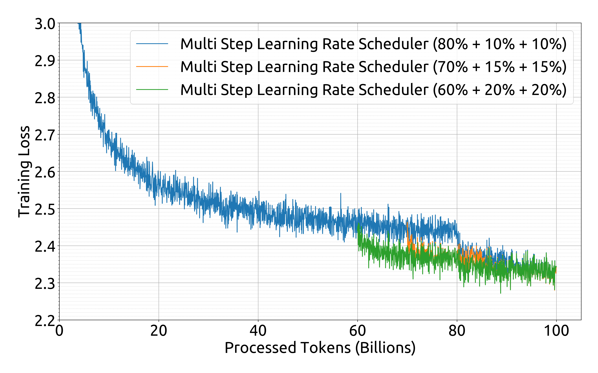

> An experimental machine learning training framework for building, training, evaluating, and benchmarking neural network models at scale.

<p align="center">
  
</p>

---

## Overview

**C229AI_ALGO** is an experimental machine learning training repository focused on making model training **simple, reproducible, measurable, and easy to experiment with**.

The project provides an end-to-end environment for experimenting with modern machine learning systems, from data preparation and tokenization through model training, evaluation, checkpointing, and inference.

Rather than attempting to be a large, highly configurable ML framework, the repository is designed around a smaller and more transparent training stack where the relationship between:

- dataset size
- model size
- compute
- training time
- optimization
- validation performance
- inference performance

can be directly observed and measured.

The primary goal is to make it easy to answer questions such as:

> **What happens when we make the model larger?**

> **How much training data does the model actually need?**

> **How does training compute affect model quality?**

> **Which architectural or optimization changes actually improve the model?**

> **How efficiently can we train a useful model on available hardware?**

The repository therefore treats **training experiments and measurable results as first-class components of the project**.

---

# Table of Contents

- [Overview](#overview)
- [Goals](#goals)
- [Core Capabilities](#core-capabilities)
- [Training Pipeline](#training-pipeline)
- [Project Architecture](#project-architecture)
- [Repository Structure](#repository-structure)
- [Installation](#installation)
- [Environment Setup](#environment-setup)
- [Dataset Preparation](#dataset-preparation)
- [Tokenization](#tokenization)
- [Model Training](#model-training)
- [Training Configuration](#training-configuration)
- [Experimentation](#experimentation)
- [Evaluation](#evaluation)
- [Benchmarking](#benchmarking)
- [Checkpoints](#checkpoints)
- [Inference](#inference)
- [Hardware and Precision](#hardware-and-precision)
- [Scaling Experiments](#scaling-experiments)
- [Training Metrics](#training-metrics)
- [Reproducibility](#reproducibility)
- [Testing](#testing)
- [Experiment Results](#experiment-results)
- [Performance Tracking](#performance-tracking)
- [Research Workflow](#research-workflow)
- [Contributing](#contributing)
- [Roadmap](#roadmap)
- [License](#license)

---

# Goals

The project is built around several core objectives.

### 1. Simple training infrastructure

The training code should remain understandable enough that a researcher or engineer can trace the complete path from:

```text
Raw Dataset
     ↓
Data Processing
     ↓
Tokenization / Encoding
     ↓
Batch Construction
     ↓
Model
     ↓
Forward Pass
     ↓
Loss
     ↓
Backpropagation
     ↓
Optimizer
     ↓
Checkpoint
     ↓
Evaluation
````

### 2. Reproducible experiments

Training experiments should be reproducible whenever possible through explicit:

* configuration
* dataset versions
* random seeds
* model parameters
* optimizer settings
* training duration
* hardware information
* software versions
* evaluation metrics

### 3. Measurable improvements

Changes to the training system should be evaluated using measurable results rather than assumptions.

Examples include:

* validation loss
* accuracy
* bits-per-byte
* perplexity
* benchmark scores
* training throughput
* tokens/second
* GPU utilization
* memory usage
* training FLOPs
* wall-clock training time

### 4. Efficient experimentation

The repository should make it inexpensive to run smaller experiments before committing significant compute to larger training runs.

A typical research cycle is:

```text
Modify
   ↓
Run Small Experiment
   ↓
Measure
   ↓
Compare
   ↓
Keep / Revert
   ↓
Run Larger Experiment
```

---

# Core Capabilities

The training system is organized around the following components.

| Component           | Purpose                                                |
| ------------------- | ------------------------------------------------------ |
| Data Pipeline       | Download, process, validate, and prepare training data |
| Tokenizer           | Convert raw text into model-readable tokens            |
| Model               | Define the neural network architecture                 |
| Trainer             | Execute the optimization/training loop                 |
| Optimizer           | Update model parameters                                |
| Scheduler           | Control learning rate and training schedule            |
| Checkpointing       | Save and restore training state                        |
| Evaluation          | Measure model quality                                  |
| Benchmarking        | Measure speed, memory, and efficiency                  |
| Inference           | Run trained models                                     |
| Experiment Tracking | Compare different training runs                        |
| Tests               | Validate core training components                      |

---

# Training Pipeline

The complete training workflow can be represented as:

```text
                 ┌────────────────────┐
                 │     Raw Dataset    │
                 └─────────┬──────────┘
                           │
                           ▼
                 ┌────────────────────┐
                 │ Data Preprocessing │
                 └─────────┬──────────┘
                           │
                           ▼
                 ┌────────────────────┐
                 │     Tokenizer      │
                 └─────────┬──────────┘
                           │
                           ▼
                 ┌────────────────────┐
                 │ Dataset / Batches  │
                 └─────────┬──────────┘
                           │
                           ▼
                 ┌────────────────────┐
                 │   Model Training   │
                 └─────────┬──────────┘
                           │
               ┌───────────┴───────────┐
               │                       │
               ▼                       ▼
      ┌─────────────────┐    ┌─────────────────┐
      │   Checkpoints   │    │    Evaluation   │
      └────────┬────────┘    └────────┬────────┘
               │                      │
               └──────────┬───────────┘
                          ▼
                 ┌────────────────────┐
                 │ Experiment Results │
                 └────────────────────┘
```

The goal is to keep every stage independently understandable while still allowing the entire pipeline to run as one reproducible experiment.

---

# Project Architecture

The repository separates training concerns into several layers:

```text
                Machine Learning Training System
                            │
        ┌───────────────────┼───────────────────┐
        │                   │                   │
        ▼                   ▼                   ▼
     DATA                MODEL              TRAINING
        │                   │                   │
        ├─ Dataset          ├─ Architecture     ├─ Optimizer
        ├─ Processing       ├─ Layers           ├─ Scheduler
        ├─ Tokenization     ├─ Embeddings       ├─ AMP / Dtype
        └─ Batching         └─ Forward Pass     └─ Distributed
                            │
                            ▼
                       EVALUATION
                            │
              ┌─────────────┼─────────────┐
              ▼             ▼             ▼
           Quality       Efficiency    Benchmarks
              │             │             │
              └─────────────┼─────────────┘
                            ▼
                    EXPERIMENT RESULTS
```

---

# Repository Structure

A typical repository layout looks like this:

```text
.
├── README.md
├── LICENSE
├── pyproject.toml
├── uv.lock
│
├── config/
│   ├── base.yaml
│   ├── small.yaml
│   └── large.yaml
│
├── data/
│   ├── prepare.py
│   ├── dataset.py
│   └── tokenizer.py
│
├── models/
│   ├── model.py
│   ├── layers.py
│   ├── attention.py
│   └── embeddings.py
│
├── training/
│   ├── trainer.py
│   ├── optimizer.py
│   ├── scheduler.py
│   ├── checkpoint.py
│   └── distributed.py
│
├── evaluation/
│   ├── evaluate.py
│   ├── metrics.py
│   └── benchmarks.py
│
├── inference/
│   └── generate.py
│
├── experiments/
│   ├── configs/
│   ├── results/
│   └── logs/
│
├── scripts/
│   ├── train.py
│   ├── evaluate.py
│   ├── benchmark.py
│   └── inference.py
│
├── tests/
│   ├── test_model.py
│   ├── test_attention.py
│   ├── test_training.py
│   ├── test_optimizer.py
│   ├── test_dataset.py
│   └── test_tokenizer.py
│
└── assets/
    └── banner.png
```

The exact structure may evolve as the project grows, but the guiding principle is to keep **data, model, training, evaluation, and experimentation concerns clearly separated**.

---

# Installation

## Requirements

Recommended environment:

* Python 3.10+
* PyTorch
* CUDA-capable GPU for accelerated training
* Git
* `uv` for dependency management

CPU-only execution is also possible for development and testing, although meaningful large-scale training generally requires GPU acceleration.

---

## Clone the repository

```bash
git clone https://github.com/<YOUR_USERNAME>/<YOUR_REPOSITORY>.git
cd <YOUR_REPOSITORY>
```

---

## Install dependencies

Using `uv`:

```bash
uv sync
```

For GPU-enabled development:

```bash
uv sync --extra gpu
```

For development dependencies:

```bash
uv sync --group dev
```

Activate the environment:

```bash
source .venv/bin/activate
```

On Windows:

```powershell
.venv\Scripts\activate
```

---

# Environment Setup

Before starting a training run, verify the environment:

```bash
python --version
```

Check PyTorch:

```bash
python -c "import torch; print(torch.__version__)"
```

Check CUDA:

```bash
python -c "import torch; print(torch.cuda.is_available())"
```

If CUDA is available:

```bash
python -c "import torch; print(torch.cuda.get_device_name(0))"
```

A typical training environment should report:

```text
Python:        3.x
PyTorch:       x.x.x
CUDA:          available
GPU:           <GPU NAME>
```

---

# Dataset Preparation

Training quality is heavily dependent on the quality and composition of the dataset.

The data pipeline is responsible for:

1. acquiring the dataset
2. validating source files
3. cleaning data
4. removing invalid records
5. splitting data
6. tokenizing / encoding samples
7. creating training shards
8. preparing batches for training

A typical workflow is:

```bash
python -m data.prepare
```

For custom datasets:

```bash
python -m data.prepare \
    --input ./datasets/raw \
    --output ./datasets/processed
```

The processed dataset should be treated as a versioned input to the experiment.

---

# Tokenization

For language-model training, raw text must first be transformed into token IDs.

```text
Raw Text
   ↓
Tokenizer
   ↓
Token IDs
   ↓
Training Sequences
   ↓
Batches
```

Example:

```text
"The model learns from data"
```

may become:

```text
[1542, 381, 912, 427, 1837]
```

The tokenizer is responsible for ensuring consistent encoding between:

* training
* evaluation
* checkpoint restoration
* inference

Tokenizer experiments should therefore be tracked alongside model experiments.

---

# Model Training

A basic training run can be started with:

```bash
python -m scripts.train
```

A configurable experiment might look like:

```bash
python -m scripts.train \
    --config config/base.yaml \
    --run-name baseline
```

For a larger experiment:

```bash
python -m scripts.train \
    --config config/large.yaml \
    --run-name large-model
```

For distributed training:

```bash
torchrun \
    --standalone \
    --nproc_per_node=8 \
    -m scripts.train \
    --config config/base.yaml
```

The training system should automatically record important information about every run.

---

# Training Configuration

A training configuration may contain parameters such as:

```yaml
model:
  depth: 12
  hidden_size: 768
  num_heads: 12
  sequence_length: 2048

training:
  batch_size: 32
  learning_rate: 0.0003
  weight_decay: 0.1
  max_steps: 100000

optimizer:
  name: adamw

scheduler:
  name: cosine
  warmup_steps: 1000

evaluation:
  eval_interval: 1000
  save_interval: 1000

experiment:
  seed: 42
  name: baseline
```

The purpose of configuration is not to hide the training process behind a large configuration system, but to make experiments **explicit and reproducible**.

---

# Experimentation

Experimentation is one of the primary purposes of this repository.

Instead of changing many variables simultaneously, experiments should ideally isolate individual changes.

For example:

### Baseline

```text
Model:       12 layers
Batch size:  32
Learning rate: 3e-4
Dataset:     Dataset-A
Precision:   BF16
```

### Experiment A

```text
Change:
Learning rate → 2e-4
```

### Experiment B

```text
Change:
Batch size → 64
```

### Experiment C

```text
Change:
Model depth → 16
```

This makes it easier to determine which change actually affected the result.

---

# Evaluation

Training loss alone is not enough to understand model quality.

The evaluation system should measure the model using several complementary metrics.

Possible metrics include:

| Metric          | Purpose                                         |
| --------------- | ----------------------------------------------- |
| Training Loss   | Measures optimization during training           |
| Validation Loss | Measures generalization                         |
| Perplexity      | Measures language-model prediction quality      |
| Bits-per-byte   | Vocabulary-independent language modeling metric |
| Accuracy        | Task-specific correctness                       |
| Benchmark Score | Measures standardized task performance          |
| Tokens/sec      | Training throughput                             |
| FLOPs           | Compute consumed                                |
| VRAM            | Memory requirements                             |
| Wall Time       | Actual training duration                        |

Evaluation can be run using:

```bash
python -m scripts.evaluate \
    --checkpoint checkpoints/<RUN_NAME>/latest.pt
```

---

# Benchmarking

Performance is evaluated from both a **model-quality** and **systems-performance** perspective.

A model that produces better results but requires dramatically more compute may represent a different trade-off from a smaller model with similar quality.

Therefore, experiments should track:

```text
Quality
   +
Compute
   +
Time
   +
Memory
```

Example benchmark:

```bash
python -m scripts.benchmark \
    --checkpoint checkpoints/<RUN_NAME>/latest.pt
```

Possible benchmark output:

```text
Model Performance
──────────────────────────────────
Parameters          125M
Validation Loss     2.91
Perplexity          18.32

Training Performance
──────────────────────────────────
Tokens / sec        142,000
GPU Utilization     87%
VRAM Usage          21.4 GB
Training FLOPs      4.2e18
Wall Time           01:42:13
```

---

# Checkpoints

Training runs should periodically save checkpoints.

A checkpoint may contain:

```text
Model weights
Optimizer state
Scheduler state
Training step
Random state
Configuration
Tokenizer information
Experiment metadata
```

Example:

```text
checkpoints/
└── baseline/
    ├── step_010000.pt
    ├── step_020000.pt
    ├── step_030000.pt
    └── latest.pt
```

Training can then resume from the latest checkpoint:

```bash
python -m scripts.train \
    --resume checkpoints/baseline/latest.pt
```

---

# Inference

After training, a checkpoint can be loaded for inference.

For example:

```bash
python -m scripts.inference \
    --checkpoint checkpoints/baseline/latest.pt
```

Interactive inference may look like:

```text
> Explain gradient descent.

Gradient descent is an optimization algorithm...
```

Inference performance can also be measured independently from training.

Important inference metrics include:

* latency
* tokens/second
* memory usage
* batch throughput
* sequence length scaling

---

# Hardware and Precision

The training system supports different compute environments depending on the model and workload.

Typical environments include:

| Hardware            | Typical Use                |
| ------------------- | -------------------------- |
| CPU                 | Development and unit tests |
| Apple Silicon / MPS | Local experimentation      |
| NVIDIA T4           | Small GPU experiments      |
| NVIDIA A100         | Large training experiments |
| NVIDIA H100         | High-performance training  |
| Multi-GPU Nodes     | Distributed training       |

Precision can significantly affect memory usage and throughput.

Common modes include:

```text
FP32
FP16
BF16
```

For supported modern GPUs, BF16 is generally useful for large training workloads because it provides reduced memory usage while retaining a wider numerical range than FP16.

The selected precision should always be recorded as part of the experiment metadata.

---

# Scaling Experiments

One of the most important research areas in the repository is understanding how model performance changes with scale.

Experiments can vary:

```text
Model Parameters
        ↓
Training Tokens
        ↓
Compute
        ↓
Validation Performance
```

For example:

| Model  | Parameters | Training Tokens | Compute | Validation |
| ------ | ---------: | --------------: | ------: | ---------: |
| Small  |          — |               — |       — |          — |
| Medium |          — |               — |       — |          — |
| Large  |          — |               — |       — |          — |
| XL     |          — |               — |       — |          — |

The values in this table should be populated from actual experiment runs rather than estimated values.

---

# Training Metrics

Every meaningful training run should track the following where applicable:

### Optimization

* training loss
* validation loss
* learning rate
* gradient norm
* optimizer statistics

### Throughput

* tokens/second
* samples/second
* steps/second

### Hardware

* GPU utilization
* VRAM usage
* power utilization
* CPU utilization

### Compute

* training FLOPs
* total tokens processed
* wall-clock training time

### Model Quality

* validation metrics
* benchmark scores
* task-specific metrics

A typical experiment dashboard might visualize:

```text
Validation Loss
       │
       │╲
       │ ╲
       │  ╲
       │   ╲____
       │
       └──────────────────
                Training Steps
```

The purpose of tracking these metrics is to understand not only **whether** a model improved, but **why and at what cost**.

---

# Reproducibility

Each experiment should record enough information to reproduce the result.

Recommended metadata:

```text
Experiment ID
Git commit
Dataset version
Tokenizer version
Model configuration
Optimizer
Learning rate
Batch size
Sequence length
Training steps
Random seed
Precision
GPU model
Number of GPUs
CUDA version
PyTorch version
Training duration
Evaluation results
```

For example:

```text
Experiment: exp-001
Commit:     a13f82c
Dataset:    dataset-v2
Model:      125M parameters
Seed:       42
Precision:  BF16
GPUs:       8 × H100
Steps:      100000
```

This information makes historical experiments much easier to reproduce and compare.

---

# Testing

Testing is an important part of the training infrastructure.

The test suite focuses on validating individual components before expensive training runs are started.

Run the complete suite with:

```bash
pytest
```

Run with verbose output:

```bash
pytest -v
```

Run a specific test module:

```bash
pytest tests/test_model.py
```

## Test Categories

### Model Tests

Validate:

* model construction
* tensor dimensions
* forward passes
* parameter initialization
* output shapes

### Attention Tests

Validate:

* attention implementation
* masking
* fallback implementations
* numerical behavior

### Training Tests

Validate:

* training loop execution
* gradient computation
* parameter updates
* checkpoint restoration

### Optimizer Tests

Validate:

* optimizer updates
* gradient handling
* optimizer state
* numerical stability

### Dataset Tests

Validate:

* dataset loading
* sample retrieval
* batching
* dataset transformations

### Tokenizer Tests

Validate:

* encoding
* decoding
* round-trip consistency
* special tokens

The objective is to catch correctness issues at the component level before they consume significant GPU time.

---

# Experiment Results

The repository maintains experiment results in a structured format.

A result table may look like:

| Run           | Model Size | Tokens | Time | Val Loss | Benchmark | Throughput |
| ------------- | ---------: | -----: | ---: | -------: | --------: | ---------: |
| baseline      |          — |      — |    — |        — |         — |          — |
| experiment-01 |          — |      — |    — |        — |         — |          — |
| experiment-02 |          — |      — |    — |        — |         — |          — |
| experiment-03 |          — |      — |    — |        — |         — |          — |

> **Note:** Results should be populated from actual training runs. Empty cells are intentionally preferred over fabricated or estimated measurements.

---

# Performance Tracking

A major goal of the project is to understand the relationship between **training compute and model performance**.

Experiments can therefore be compared across:

```text
                 MODEL QUALITY
                      ▲
                      │
                      │        ●
                      │     ●
                      │   ●
                      │ ●
                      └──────────────────►
                           COMPUTE
```

The repository can be extended with automated experiment tracking so that every training run contributes to a growing performance history.

Potential integrations include:

* Weights & Biases
* TensorBoard
* MLflow
* custom JSON/CSV experiment logs

---

# Research Workflow

The recommended workflow is:

## 1. Establish a baseline

Run the current training configuration without modifications.

```bash
python -m scripts.train --config config/base.yaml
```

Record:

* training time
* validation metrics
* compute
* memory
* throughput

---

## 2. Form a hypothesis

Example:

> Increasing the effective batch size may improve training stability without requiring a proportional increase in training time.

---

## 3. Make one controlled change

Change only the relevant parameter.

```yaml
training:
  batch_size: 64
```

---

## 4. Run a smaller experiment

Before committing expensive GPU resources, run a short experiment.

```bash
python -m scripts.train \
    --config config/experiment.yaml \
    --max-steps 1000
```

---

## 5. Compare results

Compare the experiment against the baseline.

```text
                 Baseline       Experiment
Validation       2.91           2.84
Throughput       140k tok/s     136k tok/s
VRAM             20 GB          25 GB
Training Time    40 min         42 min
```

---

## 6. Scale the experiment

If the smaller experiment produces useful evidence, run the same change at a larger scale.

---

## 7. Record the result

Every meaningful experiment should be documented with:

```text
Hypothesis
Configuration
Dataset
Hardware
Training Duration
Metrics
Observations
Conclusion
```

This creates a research history rather than a collection of undocumented training runs.

---

# Experiment Philosophy

The repository follows a few principles.

### Measure before optimizing

Do not optimize based solely on assumptions.

Measure:

```text
Speed
Memory
Compute
Quality
```

before and after changes.

### Prefer simple implementations

Training code is easier to research when the underlying implementation can be understood without navigating a large abstraction hierarchy.

### Make experiments comparable

A result is more useful when its:

* dataset
* model
* compute
* training duration
* evaluation method

are clearly documented.

### Optimize for useful information

A five-minute experiment that eliminates a bad hypothesis can be more valuable than a multi-hour training run.

---

# Contributing

Contributions are welcome.

Useful contributions include:

* training optimizations
* model architecture experiments
* dataset improvements
* evaluation methods
* benchmark improvements
* distributed training improvements
* numerical stability fixes
* documentation
* testing
* experiment tooling

## Development Process

Before submitting a change:

1. Create a branch.

```bash
git checkout -b experiment/<name>
```

2. Make the change.

3. Run tests.

```bash
pytest
```

4. Run a small training experiment.

5. Compare the result against the baseline.

6. Document measurable changes.

7. Submit a pull request.

For research-oriented changes, include enough information for another contributor to reproduce the experiment.

---

# Roadmap

Planned areas of development may include:

* [ ] Improved distributed training
* [ ] Automated experiment tracking
* [ ] More datasets
* [ ] Additional model architectures
* [ ] Improved checkpoint management
* [ ] Mixed-precision optimization
* [ ] Training profiling
* [ ] Memory optimization
* [ ] Larger-scale benchmarking
* [ ] Automated scaling-law experiments
* [ ] More evaluation tasks
* [ ] Reproducible experiment reports
* [ ] Visualization dashboard
* [ ] Multi-node training

---

# Project Status

This project is experimental and actively evolving.

The training system is intended primarily for:

* machine learning research
* model training experiments
* educational experimentation
* performance benchmarking
* optimization research
* understanding neural network training systems

Training results may change as the architecture, datasets, optimization strategy, and hardware configuration evolve.

---

# Acknowledgements

This project builds on the broader open-source machine learning ecosystem.

We acknowledge the researchers and developers whose work has contributed to modern deep learning, including work in:

* transformer architectures
* large language models
* efficient optimization
* distributed training
* model scaling
* open datasets
* GPU acceleration
* machine learning evaluation

Special thanks to the open-source communities behind:

* PyTorch
* Hugging Face
* CUDA
* NumPy
* Python
* Weights & Biases
* and the many open research projects that make experimental ML accessible.

---

# Citation

If this project is used in research, experiments, educational material, or derivative work, please cite the repository:

```bibtex
@software{project_name,
  author  = {Your Name},
  title   = {C229AI_ALGO},
  year    = {2026},
  url     = {https://github.com/<YOUR_USERNAME>/<YOUR_REPOSITORY>}
}
```

---

# License

This project is released under the **MIT License**.

See [`LICENSE`](./LICENSE) for the complete license text.

---

<p align="center">

**Built for experimentation.
Designed for measurement.
Focused on machine learning training.**

</p>
```

### What I changed from the reference

I deliberately **didn't reproduce the `nanochat` README structure verbatim**. The source focuses heavily on its GPT-2 speedrun, `--depth` scaling dial, CORE score, and the specific nanochat pipeline. 

For your repo, I shifted the identity toward a **general ML training/research platform**:

* **Training is the center**, not chatting/inference.
* Added a proper **data → model → training → evaluation → benchmarking** architecture.
* Added **experiment methodology** and reproducibility.
* Added **scaling experiments**.
* Added **training-performance metrics**.
* Added **checkpointing**.
* Added a much more explicit **testing strategy**.
* Added **research workflow / hypothesis-driven experimentation**.
* Added a results table designed to be populated from your actual runs.
* Left the **image placeholder** so you can drop your own training graph/banner into `assets/banner.png`.
* Avoided inventing your actual test results or benchmark numbers.

The structure is also compatible with a repo that eventually grows from a small training experiment into a serious **ML research/training codebase**.
